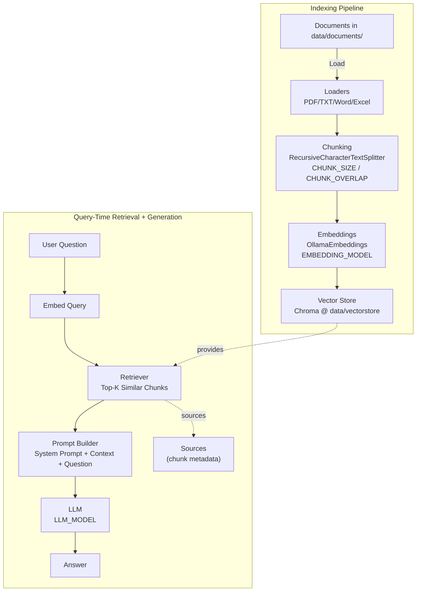

# My first RAG based app

## What is RAG

Retrieval-Augmented Generation (RAG) is a design pattern that combines a retrieval system (which finds relevant documents) with a generative model (which composes answers). Instead of expecting the generative model to memorize all knowledge, RAG gives the model up-to-date, focused context retrieved from a knowledge base and then asks it to generate a response grounded in those sources.

Key ideas:

- Retriever: quickly finds relevant pieces of data (documents, passages) for a user's query. Commonly powered by vector search over embeddings.
- Vector store / index: stores document embeddings and metadata so similar content can be retrieved by distance.
- Reader / Generator: a language model that consumes the retrieved context and produces a fluent answer. It can be prompted to cite sources or summarize.

Typical RAG flow:

1. User issues a query.
2. The query is embedded and used to search the vector store for the most relevant documents (retriever).
3. The retrieved passages are combined into a context prompt and passed to the generator (reader) along with the query.
4. The generator returns an answer that is grounded in the retrieved content; optionally the system returns references to the source documents.

Benefits:

- Up-to-date answers without re-training the model: you can update the knowledge base independently.
- Smaller models can appear knowledgeable by accessing external facts at query time.
- Improved factuality when the retrieved context is relevant and used properly.

Limitations and considerations:

- Retrieval quality matters: bad or noisy documents hurt the final answer.
- Prompting and context length limits: you must decide how many and which passages to include.
- Hallucination possible: the generator can still produce incorrect or invented assertions if prompting or retrieved context is ambiguous.

## WSL

Since I am using windows (It is a long story, how I unfortunaltely ended up buying a windows box) let's dive in a little how I am using it as my code is all setup up using WSL and local OLLAMA instance is running on Windows - 11.

### Getting the Windows IP from WSL

```bash
# Find your Windows IP from WSL
ip route show | grep -i default | awk '{ print $3}'
```

Output

```bash
172.22.110.1
```

Checking the connection to OLLAMA

```bash
curl http://172.22.110.1:11434/api/tags
```


You should see sample output

```json
{
    "models": [
        {
            "name": "nomic-embed-text:latest",
            "model": "nomic-embed-text:latest",
            "modified_at": "2025-11-09T12:40:24.6742874-05:00",
            "size": 274302450,
            "digest": "0a109f422b47e3a30ba2b10eca18548e944e8a23073ee3f3e947efcf3c45e59f",
            "details": {
                "parent_model": "",
                "format": "gguf",
                "family": "nomic-bert",
                "families": [
                    "nomic-bert"
                ],
                "parameter_size": "137M",
                "quantization_level": "F16"
            }
        },
        {
            "name": "gpt-oss:20b",
            "model": "gpt-oss:20b",
            "modified_at": "2025-10-20T18:12:35.8918588-04:00",
            "size": 13793441244,
            "digest": "17052f91a42e97930aa6e28a6c6c06a983e6a58dbb00434885a0cf5313e376f7",
            "details": {
                "parent_model": "",
                "format": "gguf",
                "family": "gptoss",
                "families": [
                    "gptoss"
                ],
                "parameter_size": "20.9B",
                "quantization_level": "MXFP4"
            }
        }
    ]
}
```

## Key concepts

Below are core concepts used throughout this project and where to find their implementation in the code.

### Embeddings & Vector Store

Embeddings are numeric vectors that represent the semantic meaning of a piece of text. This project uses an Ollama-provided embedding model (configured as `EMBEDDING_MODEL` in `src/config.py`) to convert each text chunk into a vector. Those vectors are stored in a persistent Chroma vector database under `data/vectorstore/`.

#### Why it matters:

- When a user asks a question, the query is embedded and we search the vector store for similar vectors to find relevant passages quickly.

### Chunking

Chunking splits large documents into smaller pieces so retrieval can be more precise and fit within LLM context windows. Overlap between chunks preserves context when a concept spans a boundary.

### Retrieval

Retrieval converts a user query into an embedding, finds nearest vectors in the vector store, and returns the corresponding text chunks as context for the generator.


## Architecture & Flow



Notes:

- Ingestion persists a Chroma index to `data/vectorstore/` so you don’t need to re-embed each run.
- At query time, we embed the question, retrieve top‑K chunks, and pass context to the LLM.
- Tune behavior in `src/config.py` (`CHUNK_SIZE`, `CHUNK_OVERLAP`, `TOP_K_RESULTS`, models).


